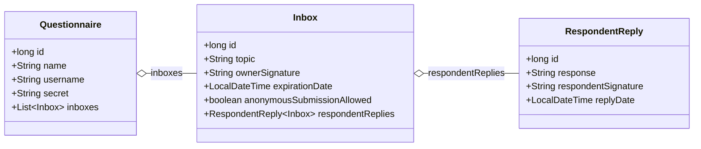

```mermaid
classDiagram
    direction RL
    class Questionnaire {
        +long id
        +String name
        +String username
        +String secret
        +List~Inbox~ inboxes
    }
    class Inbox {
        +long id
        +String topic
        +String ownerSignature
        +LocalDateTime expirationDate
        +boolean anonymousSubmissionAllowed
        +RespondentReply~Inbox~ respondentReplies
    }
    class RespondentReply {
        +long id
        +String response
        +String respondentSignature
        +LocalDateTime replyDate
    }
    Inbox --o Questionnaire: inboxes
    RespondentReply --o Inbox: respondentReplies
```
