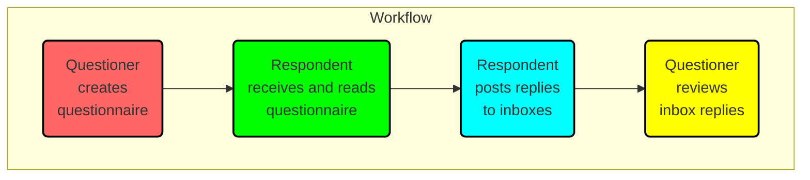
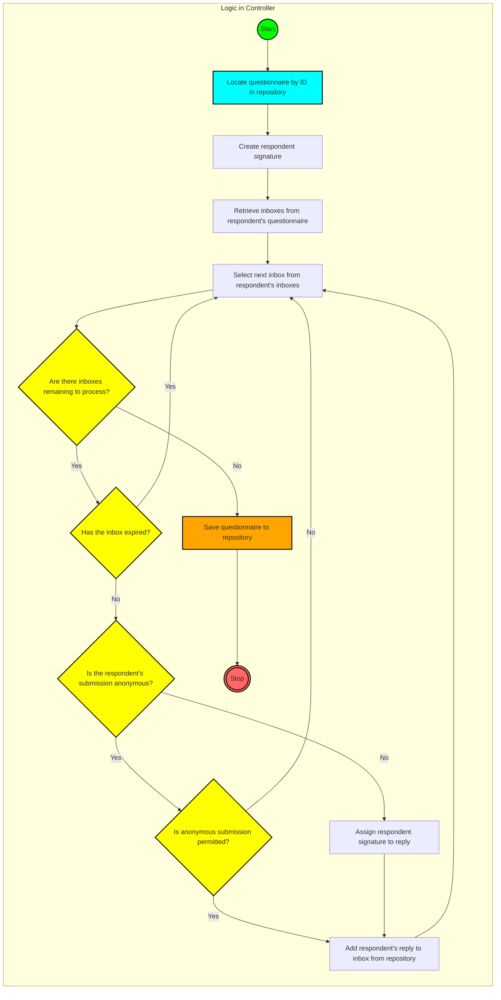

```mermaid
flowchart LR
    Q_CR(Questioner<br>creates<br>questionnaire):::redBox
    R_RD(Respondent<br>receives and reads<br>questionnaire):::greenBox
    R_RS(Respondent<br>posts replies<br>to inboxes):::cyanBox
    Q_RD(Questioner<br>reviews<br>inbox replies):::yellowBox
%% Flows
    subgraph "Workflow"
        direction LR
        Q_CR --> R_RD
        R_RD --> R_RS
        R_RS --> Q_RD
    end
%% Style Definitions
    classDef redBox fill: #ff6666, stroke: #000, stroke-width: 2px
    classDef greenBox fill: #00ff00, stroke: #000, stroke-width: 2px
    classDef cyanBox fill: #00ffff, stroke: #000, stroke-width: 2px
    classDef yellowBox fill: #ffff00, stroke: #000, stroke-width: 2px
    classDef orangeBox fill: #ffa500, stroke: #000, stroke-width: 2px
```

```mermaid
flowchart LR
    START((Start)):::greenBox
    STOP(((Stop))):::redBox
    A[Locate questionnaire by ID in repository]:::cyanBox
    B[Create respondent signature]
    C[Retrieve inboxes from respondent's questionnaire]
    D[Select next inbox from respondent's inboxes]
    E{Are there inboxes remaining to process?}:::yellowBox
    F{Has the inbox expired?}:::yellowBox
    G{Is the respondent's submission anonymous?}:::yellowBox
    H{Is anonymous submission permitted?}:::yellowBox
    I[Assign respondent signature to reply]
    J[Add respondent's reply to inbox from repository]
    K[Save questionnaire to repository]:::orangeBox
%% Flows
    subgraph "Logic in Controller"
        START --> A
        A --> B
        B --> C
        C --> D
        D --> E
        E -->|Yes| F
        E -->|No| K
        F -->|Yes| D
        F -->|No| G
        G -->|Yes| H
        G -->|No| I
        H -->|Yes| J
        H -->|No| D
        I --> J
        J --> D
        K --> STOP
    end
%% Style Definitions
    classDef redBox fill: #ff6666, stroke: #000, stroke-width: 2px
    classDef greenBox fill: #00ff00, stroke: #000, stroke-width: 2px
    classDef cyanBox fill: #00ffff, stroke: #000, stroke-width: 2px
    classDef yellowBox fill: #ffff00, stroke: #000, stroke-width: 2px
    classDef orangeBox fill: #ffa500, stroke: #000, stroke-width: 2px
```

